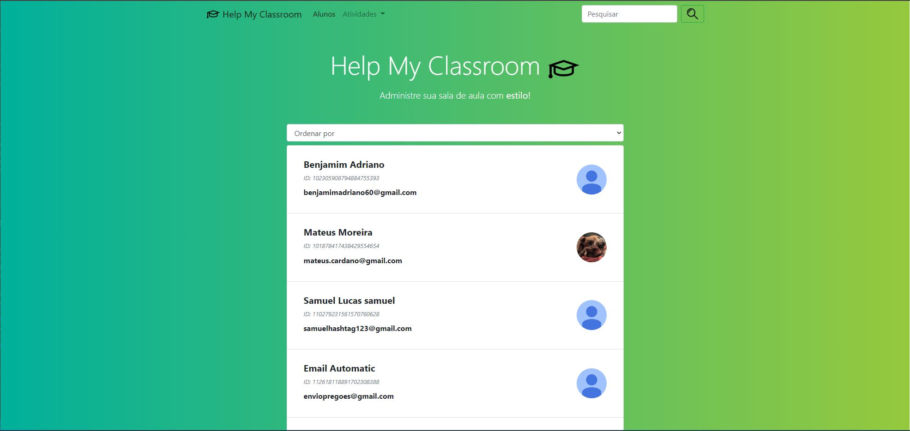

**DC_HelpMyClassroom** 

Temas:
 - D&C
 
# HelpMyClassroom

**Trabalho**: Dividir e Conquistar<br>
**Conteúdo da Disciplina**: Dividir e Conquistar<br>

## Alunos
|Matrícula | Aluno |
| -- | -- |
| 18/0024868  |  Mateus Moreira Lima |
| 19/0044390  |  Victor Rayan Adriano Ferreira |

## Sobre 
Descreva os objetivos do seu projeto e como ele funciona. 

## Screenshots

Tela Inicial de alunos matriculados.


Tela Inicial do mural.


Tela Inicial com tópicos.


## Instalação 
**Linguagem**:  Python 3<br>
**Framework**: Django e Bootstrap5<br>

Para rodar a aplicação é necessário ter instalado em sua máquina o python 3 e o Django.

### Rode o comando a seguir para instalar as dependências:
```console
$ pip install -r requirements.txt
$ pip install --upgrade google-api-python-client google-auth-httplib2 google-auth-oauthlib
```
(caso esteja utilizando pip3)
```console
$ pip3 install -r requirements.txt
$ pip3 install --upgrade google-api-python-client google-auth-httplib2 google-auth-oauthlib
```

### Para rodar a aplicação:

```console
$ python manage.py runserver
```
ou
```console
$ python3 manage.py runserver
```

### Acessar a url: 
http://127.0.0.1:8000/home/


## Uso 
Explique como usar seu projeto caso haja algum passo a passo após o comando de execução.


