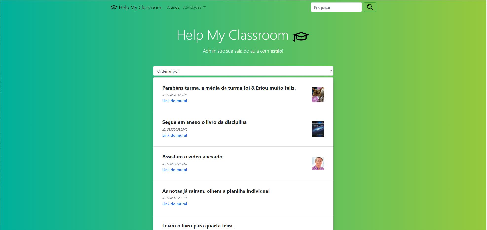
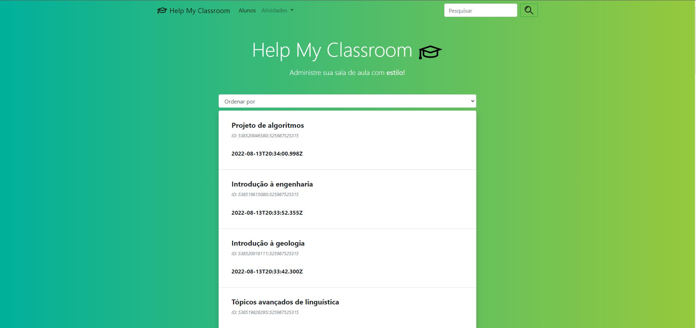
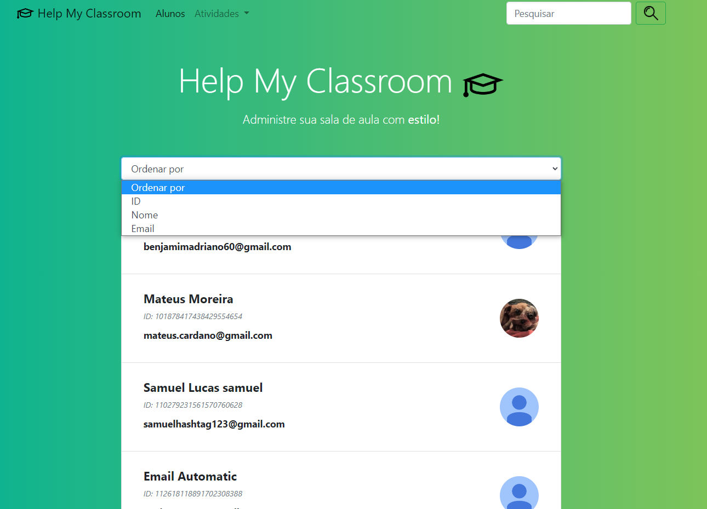
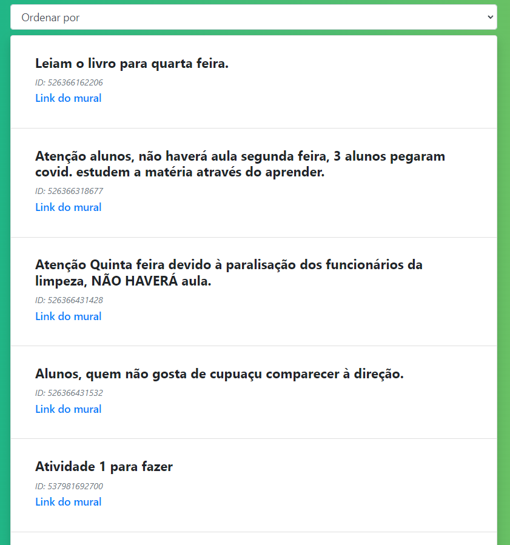
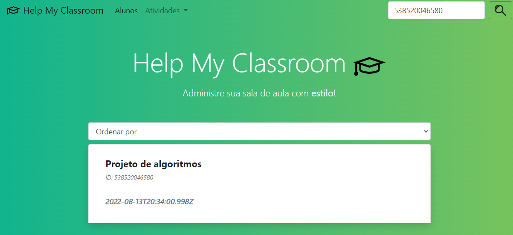

**DC_HelpMyClassroom** 

Temas:
 - D&C
 
# HelpMyClassroom

**Trabalho**: Dividir e Conquistar<br>
**Conteúdo da Disciplina**: Dividir e Conquistar<br>

## Alunos
|Matrícula | Aluno |
| -- | -- |
| 18/0024868  |  Mateus Moreira Lima |
| 19/0044390  |  Victor Rayan Adriano Ferreira |

## Sobre 

O projeto utiliza algoritmos de divisão e conquista. Utilizando a estratégia de dividir para conquistar realiza ordenação de dados vindo direto da API classroom do Google. Ordena dados como tópicos, alunos e murais. Dessa forma, o projeto é um ínicio de uma automatização para ajudar os professores administrarem suas turmas.

Algoritmos utilizados: MergeSort e Binary Search (Não foi abordado diretamente nas aulas, mas segue o paradigma do tópico, dividir para conquistar).

## Screenshots

Tela Inicial do mural.




Tela Inicial com tópicos.




Opções para filtrar com MergeSort.



MergeSort Ordenando Mural por ID.



Busca Binária procurando em tópico por ID exato.




## Instalação 
**Linguagem**:  Python 3<br>
**Framework**: Django e Bootstrap<br>

Para rodar a aplicação é necessário ter instalado em sua máquina o python 3 e o Django.

### Rode o comando a seguir para instalar as dependências:
```console
$ pip install -r requirements.txt
$ pip install --upgrade google-api-python-client google-auth-httplib2 google-auth-oauthlib
```
(caso esteja utilizando pip3)
```console
$ pip3 install -r requirements.txt
$ pip3 install --upgrade google-api-python-client google-auth-httplib2 google-auth-oauthlib
```

### Para rodar a aplicação:

```console
$ python manage.py runserver
```
ou
```console
$ python3 manage.py runserver
```

### Acessar a url: 
http://127.0.0.1:8000/


## Uso 
1. Escolha um dos dados que deseja visualizar.
2. Abra o filtro e Ordene por Id, Nome, Texto, Data etc..(MergeSort) ou Utilize FindBox e pesquise por algo mais específico(BinarySearch)
3. Exporte os dados como pdf ou para uma planilha

## Outros
Ao rodar, caso tenha problemas com as credenciais do google entre em contato com: @mateus_lm 

## Apresentação

[Video Apresentação](apresentacao\dc-classroom.mp4)


